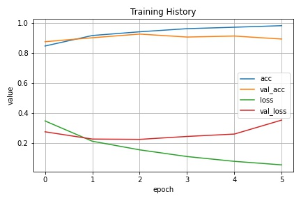

# Face Mask Detection :mask: vs :slightly_smiling_face:
Deteksi pemakaian masker dengan Artificial Intelligence. Dibangun dengan Tensorflow Python menggunakan Deep Learning

## :file_folder: Dataset
Saya mendapatkan dataset dari Kaggle (https://www.kaggle.com/omkargurav/face-mask-dataset)

## :brain: Neural Network
Saya menggunakan Convolutional (CNN) standar untuk pemakaian image classification dengan menggunakan 2 neuron sebagai output dengan `softmax` activation karena saya ingin mendapatkan output secara categorical. Saya telah mencoba mengguanakan `sigmoid` sebelumnya dan perbedaanya tidak terlalu signifikan

**Struktur CNN**
```
Model: "sequential_6"
_________________________________________________________________
Layer (type)                 Output Shape              Param #   
=================================================================
conv2d_18 (Conv2D)           (None, 222, 222, 32)      896       
_________________________________________________________________
max_pooling2d_18 (MaxPooling (None, 111, 111, 32)      0         
_________________________________________________________________
conv2d_19 (Conv2D)           (None, 109, 109, 64)      18496     
_________________________________________________________________
max_pooling2d_19 (MaxPooling (None, 54, 54, 64)        0         
_________________________________________________________________
conv2d_20 (Conv2D)           (None, 52, 52, 128)       73856     
_________________________________________________________________
max_pooling2d_20 (MaxPooling (None, 26, 26, 128)       0         
_________________________________________________________________
flatten_6 (Flatten)          (None, 86528)             0         
_________________________________________________________________
dense_12 (Dense)             (None, 128)               11075712  
_________________________________________________________________
activation_6 (Activation)    (None, 128)               0         
_________________________________________________________________
dense_13 (Dense)             (None, 2)                 258       
_________________________________________________________________
activation_7 (Activation)    (None, 2)                 0         
=================================================================
Total params: 11,169,218
Trainable params: 11,169,218
Non-trainable params: 0
```

**Proses Latihan**

<p align="center">
    
</p>

## :gear: Demonstrasi

<p align="center">
    
    
</p>

## :movie_camera: Aplikasi
Model yang telah dilatih dapat disimpan dalam bentuk `model.h5` dan dapat dideploy sebagai API agar dapat digunakan di platform yang berbeda untuk membuat aplikasi `face mask detection` secara real time melalui kamera
