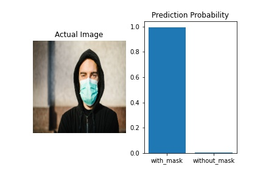
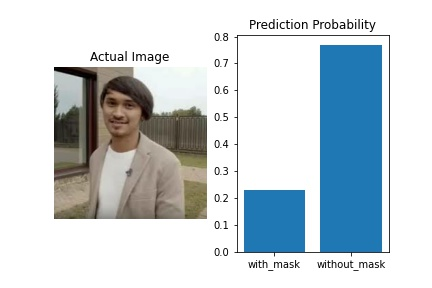

# Face Mask Detection :mask: vs :slightly_smiling_face:
Deteksi pemakaian masker dengan Artificial Intelligence. Dibangun dengan Tensorflow Python menggunakan Deep Learning

## :file_folder: Dataset
Saya mendapatkan dataset dari Kaggle (https://www.kaggle.com/omkargurav/face-mask-dataset)

## :brain: Neural Network
Saya menggunakan Convolutional (CNN) standar untuk pemakaian image classification dengan menggunakan 2 neuron sebagai output dengan `softmax` activation karena saya ingin mendapatkan output secara categorical. Saya telah mencoba mengguanakan `sigmoid` sebelumnya dan perbedaanya tidak terlalu signifikan

## :gear: Demonstrasi

  
  

## :movie_camera: Aplikasi
Model yang telah dilatih dapat disimpan dalam bentuk `model.h5` dan dapat dideploy sebagai API agar dapat digunakan di platform yang berbeda untuk membuat aplikasi `face mask detection` secara real time melalui kamera
