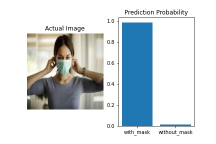
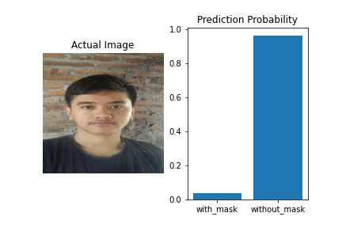

# Face Mask Detection :mask: vs :slightly_smiling_face:
Deteksi pemakaian masker dengan Artificial Intelligence. Dibangun dengan Tensorflow Python menggunakan Deep Learning

## :file_folder: Dataset
Saya mendapatkan dataset dari Kaggle (https://www.kaggle.com/omkargurav/face-mask-dataset). Data terdiri dari 7553 foto. Foto berekstensi `.jpg` dengan 3 channel (RGB). 3725 foto wajah dengan masker dan 3828 foto wajah tanpa masker dengan ukuran foto yang beragam.

## :brain: Neural Network
Saya menggunakan Convolutional (CNN) standar untuk pemakaian image classification dengan menggunakan 2 neuron sebagai output dengan `softmax` activation karena saya ingin mendapatkan output secara categorical. Saya telah mencoba mengguanakan `sigmoid` sebelumnya dan perbedaanya tidak terlalu signifikan.

**Struktur CNN**
```
Model: "sequential_6"
_________________________________________________________________
Layer (type)                 Output Shape              Param #   
=================================================================
conv2d_18 (Conv2D)           (None, 222, 222, 32)      896       
_________________________________________________________________
max_pooling2d_18 (MaxPooling (None, 111, 111, 32)      0         
_________________________________________________________________
conv2d_19 (Conv2D)           (None, 109, 109, 64)      18496     
_________________________________________________________________
max_pooling2d_19 (MaxPooling (None, 54, 54, 64)        0         
_________________________________________________________________
conv2d_20 (Conv2D)           (None, 52, 52, 128)       73856     
_________________________________________________________________
max_pooling2d_20 (MaxPooling (None, 26, 26, 128)       0         
_________________________________________________________________
flatten_6 (Flatten)          (None, 86528)             0         
_________________________________________________________________
dense_12 (Dense)             (None, 128)               11075712  
_________________________________________________________________
activation_6 (Activation)    (None, 128)               0         
_________________________________________________________________
dense_13 (Dense)             (None, 2)                 258       
_________________________________________________________________
activation_7 (Activation)    (None, 2)                 0         
=================================================================
Total params: 11,169,218
Trainable params: 11,169,218
Non-trainable params: 0
```

**Proses Latihan**

<p align="center">
    
</p>

## :gear: Demonstrasi

<p align="center">
    
    
</p>

<p align="center">
    
    
</p>

## :movie_camera: Aplikasi
Model yang telah dilatih dapat disimpan dalam bentuk `model.h5` dan dapat dideploy sebagai API agar dapat digunakan di platform yang berbeda untuk membuat aplikasi `face mask detection` secara real time melalui kamera atau menggunakan video.

## :thumbsup: Keunggulan Project
Relate dan sesuai dengan kondisi pada tahun 2020 dan masa pandemi COVID-19 dimana semua orang diwajibkan memakai masker, maka membuat project seperti ini adalah kegiatan produktif yang kreatif. Jika Neural Network dibuat dengan Transfer Learning dan menggunakan dataset yang besar, mungkin NN bisa diaplikasikan di CCTV pintu masuk gedung, gerbang, dll untuk mencegah masuknya orang yang tidak memakai masker.

## :thumbsdown: Kelemahan NN
Sejauh ini NN model dapat bekerja dengan baik, namun memiliki kelemahan. Algoritma dan Neural Network sudah tersusun dengan baik, penambahan data akan meningkatakan kualitas model secara signifikan. Berikut merupakan beberapa kelemahan yang sudah ditemukan sejauh ini.
- Masker berwarna coklat / _blend_ dengan warna kulit tidak bisa terdeteksi oleh NN
- Jika menggunakan NN secara real time, pergerakan yang banyak dapat mengganggu
- Hanya dapat mendeteksi 1 wajah dalam 1 foto. Untuk membuatnya bisa multiple harus dikombinasikan dengan `face detection`
